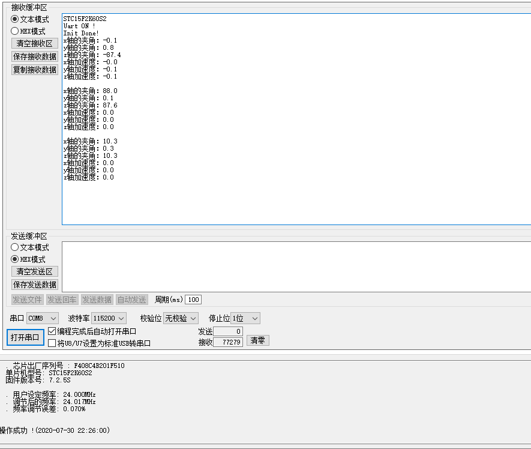

## 表情小电视

**项目简介：** 

​	开始的想法是一个小电视一样的东西，灵感来源于江灵夏草的[废旧手机不要扔……](https://www.bilibili.com/video/BV1Rb411v77n/)

​	所以说想要有的功能有：

* MPU6050构建的运动传感，在运动的时候可以对不同的运动做出各种各样的反应
* OLED 0.97” 用来显示小电视的表情
* 待机模式（没有任何动作交互的时候）可以动态显示，轮换展示日期、时间

***

### MPU6050-Test

**实现功能：**

可以通过STC-ISP串口助手进行数据的读取，读取的数据包括X轴、Y轴、Z轴的角度和加速度。

目前选用的芯片是STC15F2K60S2，串口助手的设置是：波特率115200，无校检位，停止位1位，文本模式

**效果图：**

**遇到的坑：**

* 开始死活读不出数据来，经排查是电源寄存器POWER_MANAGEMENT_1没有清零（即上电后立刻进行I2C读写操作，在mpu6050没有稳定的时候写入了数据，所以数据作废）

* 为什么I2C地址是0x68，而里面写的地址却是0xd0？

  因为I2C的地址最后一位是用来表明读写操作的，即0x68为1101000，这一共是7位地址，其中最低位的那个受ad0引脚的控制，即ad0 = 0时地址为0x68，ad0 = 1时地址为0x69（1101001），综上所述，地址的高7位是写地址时的器件地址寄存器，而最后一位是用来表明读还是写操作，举例如ad0为0时器件地址为0x68，这时候需要读，最低位就是0，后面高七位就是0x68，即11010000（0xd0），如果要写入就是0xd1（11010001）

  

***

# 未完待续…………

