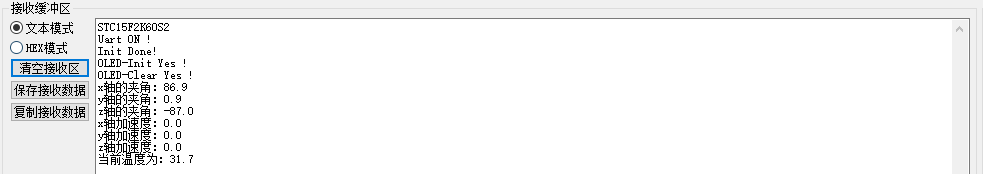

## 表情小电视

**项目简介：** 

​	开始的想法是一个小电视一样的东西，灵感来源于江灵夏草的[废旧手机不要扔……](https://www.bilibili.com/video/BV1Rb411v77n/)

​	所以说想要有的功能有：

* MPU6050构建的运动传感，在运动的时候可以对不同的运动做出各种各样的反应
* OLED 0.97” 用来显示小电视的表情
* 待机模式（没有任何动作交互的时候）可以动态显示，轮换展示日期、时间

***

### MPU6050-Test

**实现功能：**

可以通过STC-ISP串口助手进行数据的读取，读取的数据包括X轴、Y轴、Z轴的角度和加速度。

目前选用的芯片是STC15F2K60S2，串口助手的设置是：波特率115200，无校检位，停止位1位，文本模式

**效果图：**


**遇到的坑：**

* 开始死活读不出数据来，经排查是电源寄存器POWER_MANAGEMENT_1没有清零（即上电后立刻进行I2C读写操作，在mpu6050没有稳定的时候写入了数据，所以数据作废）

* 为什么I2C地址是0x68，而里面写的地址却是0xd0？

  因为I2C的地址最后一位是用来表明读写操作的，即0x68为1101000，这一共是7位地址，其中最低位的那个受ad0引脚的控制，即ad0 = 0时地址为0x68，ad0 = 1时地址为0x69（1101001），综上所述，地址的高7位是写地址时的器件地址寄存器，而最后一位是用来表明读还是写操作，举例如ad0为0时器件地址为0x68，这时候需要读，最低位就是0，后面高七位就是0x68，即11010000（0xd0），如果要写入就是0xd1（11010001）

  

***

### Main

**实现功能：**

* 上电自检，通过串口发送自检结果[串口设置为，波特率115200，无校检，1位停止位]

效果图：



​	

* 摇晃触发眩晕表情，平时是眯眯眼状态

效果视频：

## [哔哩哔哩视频导航](https://www.bilibili.com/video/BV13C4y1874Z/)

**遇到的坑：**

* 跨文件引用变量，需要加上```extern```修饰，比如说一个```mpu6050.c```的文件里面有了一个函数值需要在```mian.c```里面使用，这时候就需要使用```extern```修饰

  例如：

  ```c
  //mpu6050.c文件内容
  unsigned char temp;
  //main.c文件内容
  extern unsigned char temp;
  temp = 0xff;		//然后就可以在mian里面对temp变量进行操作了
  ```

* 报错 L104

  这是因为文件内有重复定义的变量，这时候可以通过观察错误信息，然后通过CTRL + F的形式查出重复的变量/函数

* 数据类型错误

  这种一般是开发为了简便，会在最开始的地方重定义数据类型

  例如：

  ```c
  typedef 	unsigned char	u8;
  typedef 	unsigned int	u16;
  typedef 	unsigned long	u32;
  //或者是宏定义的样子
  #define  u8 unsigned char 
  #define  u32 unsigned int 
  ```

  这个样子会比较方便，不用写一长串，但是进行移植的时候一定要用全部替换先全换成正常的```unsigned char``` 这种形式，防止移植出现问题，因为各种例程的数据类型重定义的名字都不大一样


# 未完待续…………

